# **Deep Reinforcement Learning and Technical Analysis Applied to the Stock-Market** 
### BI MASTER - Business Intelligence Master - Final Project - CCE PUC-Rio - April, 2021.

Aluno: **Osias Appel** (oappel@gmail.com)

Professor Orientador: **Leonardo Mendonza** (mendonza@ele.puc-rio.br)

---
## Sumário
---
Sistema desenvolvido a partir dos conceitos de aprendizado profundo por reforço (Deep Reinforcement Learning - DRL) para predição do preço de uma ação no decorrer sequencial dos pregões da bolsa de valores. Um agente DRL é treinado a partir dos valores históricos anteriores da ação. Nessa etapa de treinamento, o agente DRL percorre múltiplas vezes a sequência temporal de valores, ajustando a sua rede neural, de forma a realizar a sequência de atuações no mercado (compra, venda ou segura (hold)), para obter ao final do período o maior valor possível para a sua carteira. A seguir, esse agente é testado a partir de uma outra sequência temporal de preços, diferente da utilizada no treinamento, para verificação do desempenho do seu aprendizado. O sistema desenvolvido utiliza 5 tipos de modelos de agentes DRL, para verificação, ao final dos testes, qual obteve a carteira mais bem sucedida. Cada modelo é treinado com 3 métodos de recompensa: **spot** (a recompensa é o resultado da atuação do agente em relação ao valor do dia anterior), [**rsi**](https://school.stockcharts.com/doku.php?id=technical_indicators:relative_strength_index_rsi "rsi") (indicador técnico da variação do número de altas e baixas de um período) e [**mfi**](https://school.stockcharts.com/doku.php?id=technical_indicators:money_flow_index_mfi "mfi") (indicador técnico similar ao [**rsi**](https://school.stockcharts.com/doku.php?id=technical_indicators:relative_strength_index_rsi "rsi"), porém levando em consideração o volume negociado). Além de se variar o tipo de recompensa, variou-se a quantidade de vezes para treinamento no período analisado. Para os métodos [**rsi**](https://school.stockcharts.com/doku.php?id=technical_indicators:relative_strength_index_rsi "rsi") e [**mfi**](https://school.stockcharts.com/doku.php?id=technical_indicators:money_flow_index_mfi "mfi"), realizou-se a variação da recompensa negativa e positiva. Com essa combinação, foram obtidos 1020 modelos treinados. Cada modelo treinado foi testado individualmente e produzida uma classificação do desempenho. Nessa classificação de desempenho, foi utilizada a comparação do desempenho de uma carteira **buy and hold**, onde o investidor compra as ações no início do período e as retem integralmente até o fim do período estudado para teste. 

---
## Introdução
---
Aprendizado por reforço (Reinforcement Learning) é um ramo do aprendizado de máquina (Machine Learning). O seu objetivo é fazer um agente que interage (atua) com um ambiente aprender uma estratégia dessa interação que lhe proporcione a maior recompensa possível. No aprendizado profundo por reforço (Deep Reinforcement Learning - DRL) esse agente é uma rede neural de várias camadas. Esse agente configura a rede neural de forma a gerar as atuações que lhe proporcionem as maiores recompensas. A partir de uma atuação do agente, o ambiente devolve a recompensa e uma observação informando as condições do novo estado alcançado por essa atuação. Esses conceitos foram fartamente utilizados em jogos de tabuleiro, conseguindo-se resultados extraordinários contra os maiores campeões. A derrota do campeão chinês do jogo Go, pelo programa de inteligência artificial da AlphaGo da Google, é um dos mais espetaculares resultados obtidos. Deep Blue, da IBM, já havia derrotado o campeão de xadrez Kasparov. Porém, a enorme quantidade total de estados possíveis de um tabuleiro de xadrez é perfeitamente possível de ser amazenada nos modernos computadores. No jogo de Go, isso é impossível. A quantidade de estados possíveis chega ao limite da quantidade de átomos do universo! O resultado conseguido só foi possível através do DRL.

No mercado acionário, procuram-se mecanismos que possam realizar automaticamente os investimentos que dão o melhor retorno, considerando o risco máximo desejado. Esses mecanismos seriam isentos das emoções que prejudicam as decisões humanas nos momentos mais críticos. Uma das soluções é a aplicação do DRL no mercado acionário. A figura seguinte exibe a arquitetura geral dessa solução.

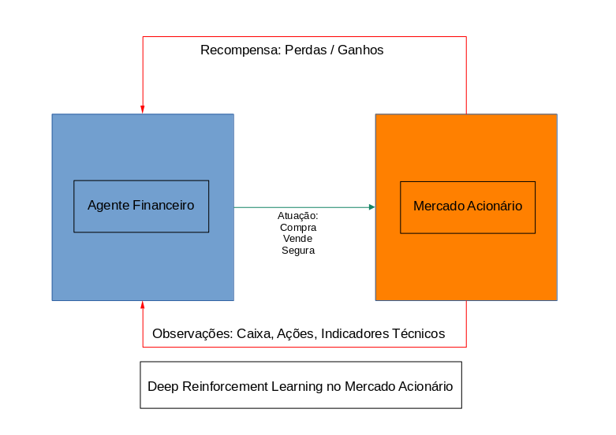

O agente financeiro DRL atua sobre o ambiente do mercado acionário atravé de 3 possíveis atuações: compra, venda ou segura (nada faz: hold). O mercado acionário devolve a recompensa da atuação, no caso, associada a perda ou ganho, com agravante do risco dessa atuação, obtido pelos indicadores técnicos. É entregue, também, para o agente um conjunto de observações relacionadas ao estado obtido pela atuação: posição financeira do caixa, quantidade de ações; e alguns indicadores técnicos relacionados a esse estado. São eles: [**rsi**](https://school.stockcharts.com/doku.php?id=technical_indicators:relative_strength_index_rsi "rsi") (índice de força relativa, ou, relative strength index) e [**mfi**](https://school.stockcharts.com/doku.php?id=technical_indicators:money_flow_index_mfi "mfi") (fluxo de dinheiro, ou, money flow index). O [**rsi**](https://school.stockcharts.com/doku.php?id=technical_indicators:relative_strength_index_rsi "rsi") varia entre 0 e 100 e indica se o mercado está sobre comprado (>70), ou sobre vendido (<30). O [**mfi**](https://school.stockcharts.com/doku.php?id=technical_indicators:money_flow_index_mfi "mfi") é uma variante do [**rsi**](https://school.stockcharts.com/doku.php?id=technical_indicators:relative_strength_index_rsi "rsi"), que leva em conta o volume negociado no mercado, variando, também, no intervalo de 0 a 100, sendo que maior que 80 indica sobre comprado, enquanto que menor que 20 indica sobre vendido. Esses indicadores, de acordo com a política de recompensa, pode agravá-la, indicando que ordens de compra no mercado sobre comprado são temerárias, enquanto que as ordens de venda no mercado sobre vendido, também o são.

---
## Metodologia adotada no desenvolvimento

---
O desenvolvimento de aplicações DRL foi impulsionado pelo surgimento do padrão definido pela empresa [OpenAI](https://openai.com/ "OpenAI"). Esse padrão se aplica sobre o [Gym.Env](https://gym.openai.com/docs/ "Gym.Env"), classe relacionada ao interface entre os agentes e o ambiente desejado. Daí, surgiram bibliotecas aplicadas sobre classes derivadas do [Gym.Env](https://gym.openai.com/docs/ "Gym.Env"). No nosso caso, empregamos a biblioteca [Stable Baselines3](https://github.com/DLR-RM/stable-baselines3 "Stable Baselines3"), desenvolvida em Pytorch. A seguir, a arquitetura mais detalhada do projeto.

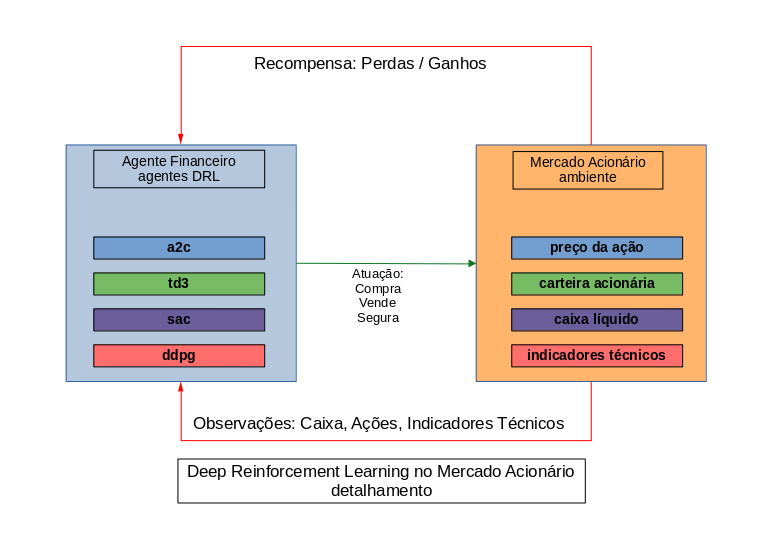

Foram empregados os seguintes modelos de agentes: 
- [Asynchronous Actor Critic - a2c](https://stable-baselines3.readthedocs.io/en/master/modules/a2c.html "a2c")
- [Soft Actor Critic - sac](https://stable-baselines3.readthedocs.io/en/master/modules/sac.html "sac")
- [Deep Deterministic Policy Gradient - ddpg](https://stable-baselines3.readthedocs.io/en/master/modules/ddpg.html "ddpg")
- [Twin Delayed DDPG - td3](https://stable-baselines3.readthedocs.io/en/master/modules/td3.html "td3")

O sistema realizou o treinamento e os testes sobre a sequência temporal dos valores da ação da Apple (AAPL) entre os dias 01/01/2009 e 01/03/2021.
O período de 01/01/2009 a 31/12/2018 foi utilizado para treinamento, enquanto que o período de 01/01/2019 a 01/03/2021 foi utilizado para testes.

O sistema está dividido em 2 programas. O primeiro realiza os testes e treino, produzindo uma planilha com todas as informações geradas na fase de testes. O segundo programa lê essa planilha e realiza as classificações dos modelos testados.

---
## Geração dos modelos treinados e testados
---
> Valores de períodos por treinamento de cada modelo: 10000, 40000, 80000, 100000
>> Modelos treinados: a2c, ddpg, td3, sac, ppo
>>> Métodos de recompensa: mfi, spot, rsi
>>>> Valores da recompensa positiva: 0.1, 0.25, 0.5, 0.75, 1 Obs.: para recompensa spot não há necessidade de variar os valores
>>>>> Valores da recompensa negativa: -0.1, -0.25, -0.5, -0.75, -1 Obs.: para recompensa spot não há necessidade de variar os valores

Dessa forma foram gerados 1020 modelos treinados, cerca de 4 dias de processamento em GPU simples.

A seguir, cada modelo foi testado e os resultados armazenados em uma planilha, para posterior backtest e classificação.

---
## Classificação do desempenho dos modelos testados
---
#### Classificação Síntese
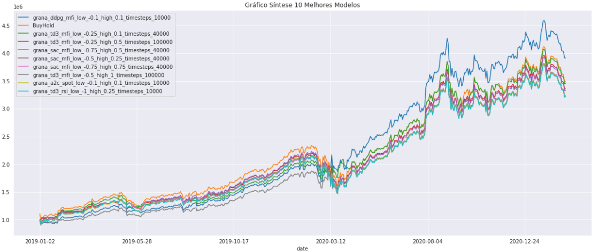
#### Classificação por Modelo DRL
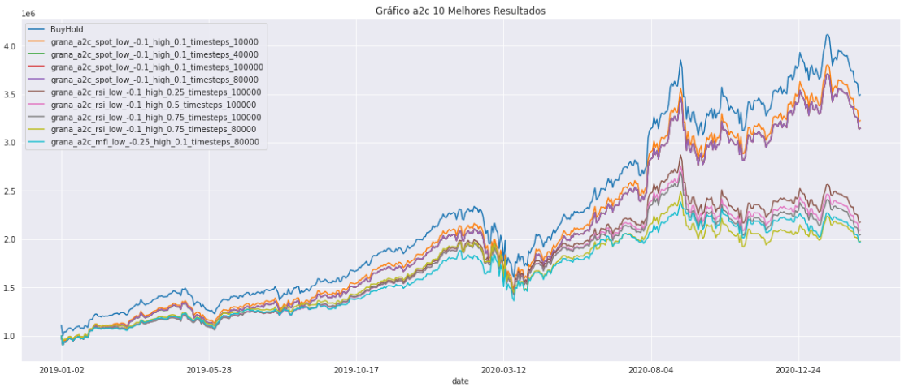
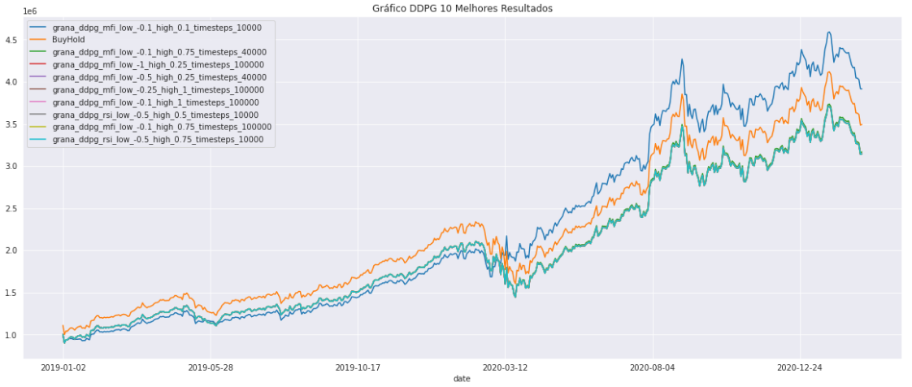
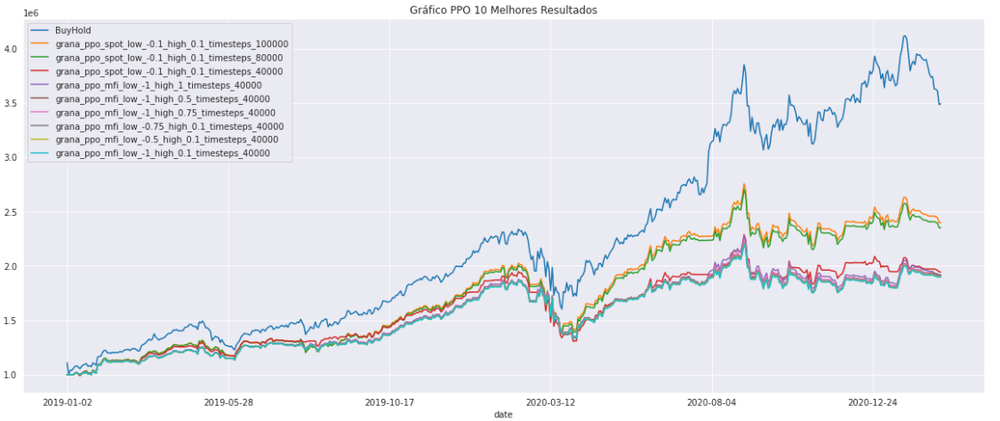
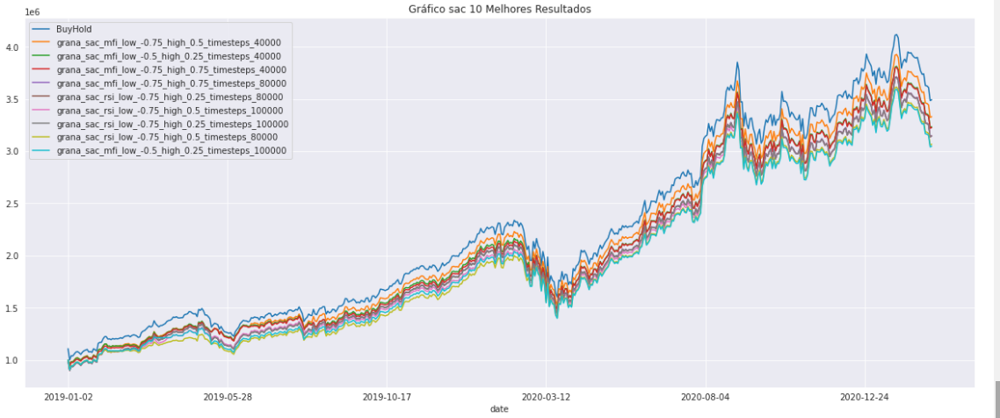
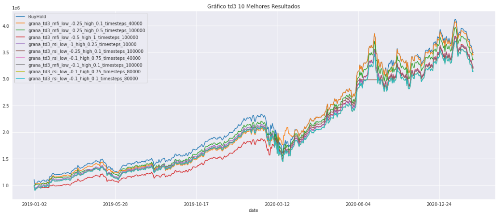
#### Classificação por Método de Recompensa
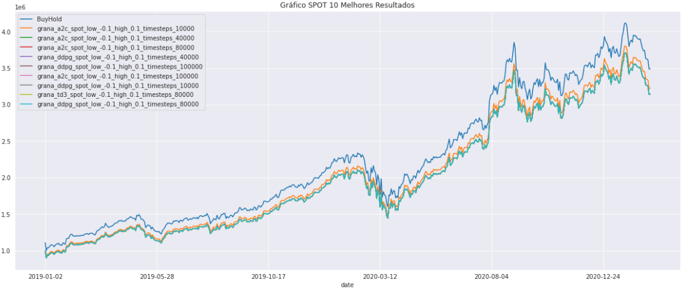
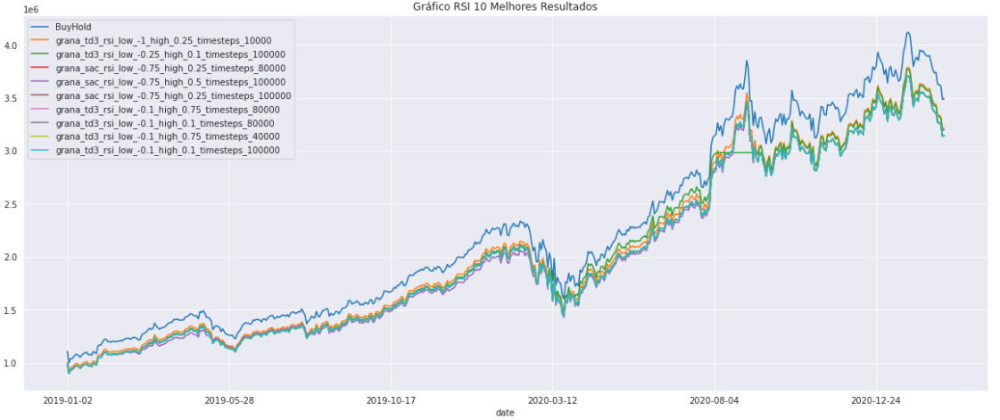
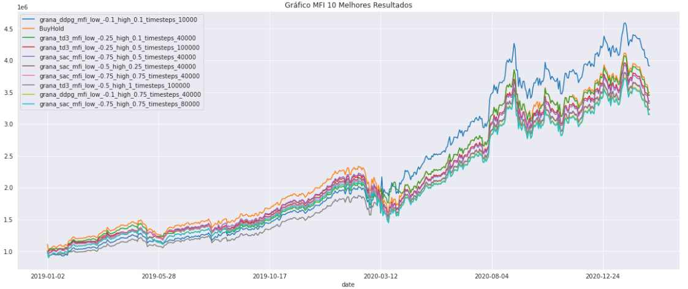
#### Resumo do Desempenho por Modelo e Recompensa
- O modelo ddpg é o de melhor desempenho.
- O método de recompensa associado ao indicador técnico mfi se sobressai em conjunto com os modelos: ddpg, td3 e sac. Isso indica que a associação do rsi com o volume negociado, que é o caso do mfi, majoritariamente se sobressai às demais formas de recompensa.
- O método ingênuo de gestão de carteira buy and hold se sobressai em relação às demais combinações, perdendo apenas para o modelo ddpg com recompensa associada ao mfi. Isso decorre do período analisado, onde os bancos centrais das principais economias fizeram injeções maciças de recursos, que acabam sendo carreados para a renda variável. Daí, os abalos periódicos decorrentes das desconfianças do possível enxugamento dessa liquidez artificial.
- Os melhores desempenhos não estão associados ao excesso de passos de análise na sequência periódica dos valores. Na literatura, há registros de overfitting, quando a quantidade de passos é exagerada.
---
## Conclusão
---
Ficou evidenciado que o DRL é bastante promissor na predição de preços em sequências não determinísticas de preços. Para isso, é fundamental a associação da metodologia de recompensa com indicadores técnicos, de preferência os associados ao volume negociado.
Os próximos passos seriam a análise no mercado de renda fixa, como por exemplo o de títulos públicos, onde a variação brusca das taxas de médio e longo prazo tem produzido oscilações que podem conduzir a resultados tão ou mais brilhantes que os do mercado de renda variável.
Outra aplicação interessante seria a gestão de carteira (portfólios) de múltiplos ativos.
Na bibliografia, encontram-se aplicações para a área de otimização através do DRL.

---
## Bibliografia
---
- 10 trading indicators every trader should know. Disponível em: <https://www.ig.com/us/trading-strategies/10-trading-indicators-every-trader-should-know-190604>. Acessado em: 03/04/2021.
- Anyscale Academy - Tutorials on Ray and Ray-based Libraries. Disponível em: <https://github.com/anyscale/academy>. Acessado em: 03/04/2021.
- Basu, S. Learn GIT with GITHUB in 5 minutes. First Edition. S Basu, 2018.
- Chollet, François. Deep Learning with Python. MEAP. Second Edition. Manning Publications, 2020.
- Cone, Matt. The Markdown Guide. Matt Cone, 2018.
- Create custom gym environments from scratch — A stock market example. Disponível em: <https://towardsdatascience.com/creating-a-custom-openai-gym-environment-for-stock-trading-be532be3910e>. Acessado em: 03/04/2021.
- Deep Reinforcement Learning for Automated Stock Trading: An Ensemble Strategy. Disponível em: <https://github.com/AI4Finance-LLC/Deep-Reinforcement-Learning-for-Automated-Stock-Trading-Ensemble-Strategy-ICAIF-2020>. Acessado em: 03/04/2021.
- Environments for OR and RL Research. Disponível em: <https://github.com/hubbs5/or-gym>. Acessado em: 03/04/2021.
- FinRL for Quantitative Finance: Tutorial for Multiple Stock Trading. Disponível em: <https://towardsdatascience.com/finrl-for-quantitative-finance-tutorial-for-multiple-stock-trading-7b00763b7530>. Acessado em: 03/04/2021.
- FinRL for Quantitative Finance: Tutorial for Portfolio Allocation. Disponível em: <https://towardsdatascience.com/finrl-for-quantitative-finance-tutorial-for-portfolio-allocation-9b417660c7cd>. Acessado em: 03/04/2021.
- FinRL for Quantitative Finance: Tutorial for Single Stock Trading. Disponível em: <https://towardsdatascience.com/finrl-for-quantitative-finance-tutorial-for-single-stock-trading-37d6d7c30aac>. Acessado em: 03/04/2021.
- FinRL: A Deep Reinforcement Learning Library for Quantitative Finance. Disponível em: <https://github.com/AI4Finance-LLC/FinRL-Library>. Acessado em: 03/04/2021.
- Fluxo de Dinheiro. Disponível em: <https://br.advfn.com/educacional/analise-tecnica/fluxo-de-dinheiro>. Acessado em: 03/04/2021.
- Github Docs. Disponível em: <https://docs.github.com/en>. Acessado em: 03/04/2021.
- GitHub Flavored Markdown Spec. Disponível em: <https://github.github.com/gfm/#blank-lines>. Acessado em: 03/04/2021.
- Gym. Disponível em: <https://gym.openai.com/>. Acessado em: 03/04/2021.
- Hilpisch, Yves. Artificial Intelligence in Finance. O’Reilly, 2021.
- Hilpisch, Yves. Python for Algorithmic Trading. O’Reilly, 2021.
- Hilpisch, Yves. Python for Finance. Second Edition. O’Reilly, 2019.
- Hubbs, Christian et al. OR-Gym: A Reinforcement Learning Library for Operations Research Problems. Disponível em: <https://arxiv.org/abs/2008.06319>. Acessado em: 04/04/2021.
- Indice de Força Relativa. Disponível em: <https://br.advfn.com/educacional/analise-tecnica/indice-de-forca-relativa-ifr>. Acessado em: 03/04/2021.
- Jansen, Stefan. Machine Learning for Algorithmic Trading. Second Edition. Packt Publishing, 2019.
- Lapan, M. Deep Reinforcement Learning Hands-On. Second Edition. Packt Publishing, 2020.
- Lightweight, Efficient and Stable DRL Implementation Using PyTorch. Disponível em: <https://github.com/AI4Finance-LLC/ElegantRL>. Acessado em: 03/04/2021.
- Liu, Yuxi (Hayden). PyTorch 1.x Reinforcement Learning Cookbook. Packt Publishing, 2019.
- Money Flow Index (MFI). Disponível em: <https://school.stockcharts.com/doku.php?id=technical_indicators:money_flow_index_mfi>. Acessado em: 03/04/2021.
- Morales, M. Grokking Deep Reinforcement. Manning Publications, 2020.
- NeoFinRL: A collection of universal environments for DRL in quant finance. Disponível em: <https://github.com/AI4Finance-LLC/NeoFinRL>. Acessado em: 03/04/2021.
- On Choosing a Deep Reinforcement Learning Library. Disponível em: <https://blog.dataiku.com/on-choosing-a-deep-reinforcement-learning-library>. Acessado em: 03/04/2021.
- Palanisamy, Praveen. Hands-On Intelligent Agents with OpenAI Gym. Packt Publishing, 2018.
- Palmas, Alessandro et al. The Reinforcement Learning Workshop. Packt Publishing, 2020.
- Ravichandiran, Sudharsan et al. Learning Path Python Reinforcement Learning. Packt Publishing, 2019.
- Ray Project Tutorial. Disponível em: <https://github.com/ray-project/tutorial/tree/master/rllib_exercises>. Acessado em: 03/04/2021.
- Ray. Disponível em: <https://github.com/ray-project/ray>. Acessado em: 03/04/2021.
- Relative Strength Index (RSI). Disponível em: <https://school.stockcharts.com/doku.php?id=technical_indicators:relative_strength_index_rsi>. Acessado em: 03/04/2021.
- Stable Baselines. Disponível em: <https://github.com/hill-a/stable-baselines>. Acessado em: 03/04/2021.
- Stable Baselines3. Disponível em: <https://github.com/DLR-RM/stable-baselines3>. Acessado em: 03/04/2021.
- Stable-Baselines3 Docs - Reliable Reinforcement Learning Implementations. Disponível em: <https://stable-baselines3.readthedocs.io/en/master/index.html>. Acessado em: 03/04/2021.
- Stock Statistics/Indicators Calculation Helper. Disponível em: <https://github.com/jealous/stockstats#stock-statisticsindicators-calculation-helper>. Acessado em: 03/04/2021.
- Tatsat, Hariom et al. Machine Learning and Data Science Blueprints for Finance. O’Reilly, 2021.
- Technical Analysis Library in Python. Disponível em: <https://github.com/bukosabino/ta>. Acessado em: 03/04/2021.
- Technical Analysis Library in Python’s Documentation. Disponível em: <https://technical-analysis-library-in-python.readthedocs.io/en/latest/index.html#>. Acessado em: 03/04/2021.
- Welcome to Stable Baselines docs! - RL Baselines Made Easy. Disponível em: <https://stable-baselines.readthedocs.io/en/master/index.html>. Acessado em: 03/04/2021.
- Xiong, Zhuoran et al. Practical Deep Reinforcement Learning Approach for Stock Trading. Disponível em: <https://arxiv.org/abs/1811.07522>. Acessado em: 04/04/2021.
- Yang, Hongyang et al. Deep Reinforcement Learning for Automated Stock Trading: An Ensemble Strategy. Disponível em: <https://papers.ssrn.com/sol3/papers.cfm?abstract_id=3690996>. Acessado em: 04/04/2021.
- Zai, Alexander et al. Deep Reinforcement Learning in Action. Manning Publications, 2020.